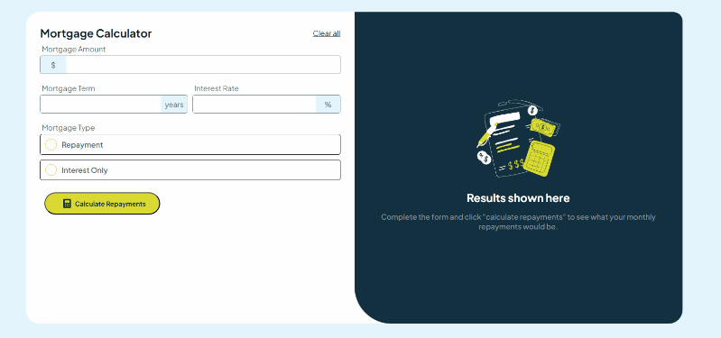

# Frontend Mentor - Mortgage repayment calculator solution

This is a solution to the [Mortgage repayment calculator challenge on Frontend Mentor](https://www.frontendmentor.io/challenges/mortgage-repayment-calculator-Galx1LXK73). Frontend Mentor challenges help you improve your coding skills by building realistic projects. 

## Table of contents

- [Overview](#overview)
  - [The challenge](#the-challenge)
  - [Demonstration](#demonstration)
  - [Links](#links)
- [My process](#my-process)
  - [Built with](#built-with)
  - [What I learned](#what-i-learned)

## Overview
This mortgage calculator allows the user to input 4 values: the loan amount, the interest rate, the loan term, and the start date. After submitting the form, the user will see the monthly repayment amount and the total repayment amount. If any field is incomplete, the user will see a form validation message. The user can only complete the form using their keyboard. The layout is responsive for different screen sizes and there are hover and focus states for all interactive elements on the page. The user can choose whether they would like to see interest only or repayments with interest and principal.

### The challenge
Users should be able to:

- Input mortgage information and see monthly repayment and total repayment amounts after submitting the form
- See form validation messages if any field is incomplete
- Complete the form only using their keyboard
- View the optimal layout for the interface depending on their device's screen size
- See hover and focus states for all interactive elements on the page
- Select the type of mortgage they would like to see (interest only or repayments with interest and principal)
- Use the calculator using various screen sizes, ranging from mobile to desktop

### Demonstration

### Links
<!-- - Solution URL: [Add solution URL here](https://your-solution-url.com) -->
- Live Site URL: [https://gorgeous-mochi-29bccc.netlify.app](https://gorgeous-mochi-29bccc.netlify.app)

## My process
I began with creating the making sure that the input fields would only take the expected input and that the input was formatted correctly i.e. with comma separation for 1000s. I then created the function to calculate the monthly and total repayments based on the input values. I then added the form validation messages and hover/focus states for the interactive elements. Finally, I made sure the layout was responsive for different screen sizes.
### Built with
- Flexbox
- CSS Grid
- Mobile-first workflow
- 
- 
- 
### What I learned
I learned how to use form validation and how to create a responsive layout using Flexbox and CSS Grid. I also learned how to restrict input fields to only allow certain input.